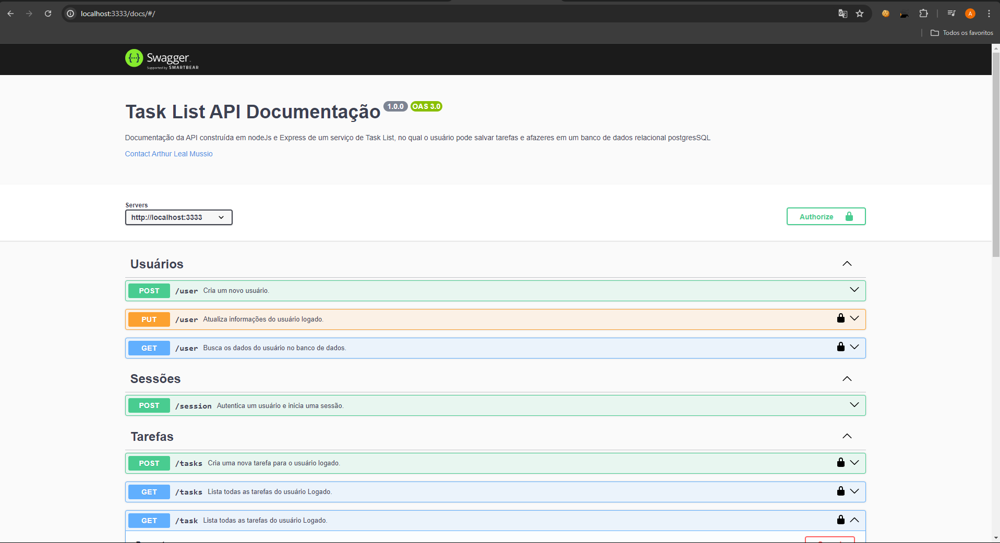

# Projeto de Aplicação Web com Sistema de Login e Gerenciador de Tarefas
Este projeto é uma aplicação web desenvolvida utilizando Next.js com TypeScript e Sass para estilização. Ele inclui funcionalidades avançadas do React para um sistema de login seguro e um gerenciador de tarefas integrado.

## Tecnologias Utilizadas

* Frontend:

    * Next.js: Framework React para renderização do lado do servidor e do cliente.
    * TypeScript: Linguagem de programação que adiciona tipagem estática ao JavaScript.
    * Sass: Pré-processador CSS para estilização modular e reutilizável.

* Backend:

    * Node.js: Ambiente de execução JavaScript server-side.
    * Express: Framework web para Node.js utilizado na construção de APIs RESTful.
    * Sequelize: ORM (Object-Relational Mapping) para interação com bancos de dados relacionais.
    * PostgreSQL: Sistema de gerenciamento de banco de dados relacional utilizado para armazenamento de dados.
    * Funcionalidades Principais

## Sistema de Login:

* Autenticação de usuários utilizando tokens JWT.
* Cadastro de novos usuários com validação de dados.

## Gerenciador de Tarefas:

* CRUD (Create, Read, Update, Delete) de tarefas.
* Associação de tarefas a usuários com permissões de acesso.
* Filtragem e ordenação de tarefas por diversos critérios.

## Estrutura do Projeto
* /frontend: Contém o código do frontend desenvolvido em Next.js.
* /backend: Contém o código do backend desenvolvido em Node.js, Express e Sequelize.

Este projeto combina a robustez do Next.js no frontend com a flexibilidade e segurança proporcionadas pelo Node.js e PostgreSQL no backend, oferecendo uma aplicação web escalável e moderna para gerenciamento de usuários e tarefas.

## Getting Started

Para começar a utilizar o projeto, siga os passos abaixo para configurar o ambiente de desenvolvimento tanto para o frontend (Next.js com TypeScript e Sass) quanto para o backend (Node.js com Sequelize e Express, conectado a um banco de dados PostgreSQL).

### Frontend (Next.js)
#### Pré-requisitos
* Certifique-se de ter o Node.js instalado na sua máquina. Você pode baixá-lo e instalá-lo a partir do [site oficial do Node.js](https://nodejs.org/pt).

#### Instalação das Dependências
* No diretório do projeto frontend, inicialmente execute o seguinte comando para instalar todas as dependências listadas no package.json:

```bash
npm install
# ou
yarn install
```
* Comandos Disponíveis
Desenvolvimento:

```bash
npm run dev
# ou
yarn dev
```
Inicia o servidor de desenvolvimento Next.js.

#### Produção:

```bash
npm run build
npm start
# ou
yarn build
yarn start
```
Compila e inicia o servidor Next.js em modo de produção.

#### Linting:

```bash
Copiar código
npm run lint
# ou
yarn lint
```
Executa o ESLint para verificar e corrigir problemas de lint no código.

### Backend (Node.js com Sequelize e Express)
#### Pré-requisitos
* Certifique-se de ter o Node.js e o PostgreSQL instalados na sua máquina. Para o PostgreSQL, você pode baixá-lo e instalá-lo a partir do site oficial do [PostgreSQL](https://www.postgresql.org/).

#### Configuração do Banco de Dados
* Certifique-se de ter um banco de dados PostgreSQL configurado e pronto para uso. Você precisará ajustar as configurações de conexão no arquivo src/config/database.js do projeto backend.

#### Instalação das Dependências
* No diretório do projeto backend, execute o seguinte comando para instalar todas as dependências listadas no package.json:

```bash
Copiar código
npm install
# ou
yarn install
```

#### Migrações do Banco de Dados
Execute as migrações do banco de dados para configurar as tabelas necessárias:

```bash
Copiar código
npm run db:migrate
# ou
yarn db:migrate
```
Este comando utilizará o sequelize-cli para aplicar todas as migrações pendentes.

* Comandos Disponíveis
Desenvolvimento com Nodemon:

```bash
Copiar código
npm run dev
# ou
yarn dev
```
Inicia o servidor backend utilizando o Nodemon para reiniciar automaticamente quando houver mudanças no código.

#### Executar Migrações:

```bash
Copiar código
npm run db:migrate
# ou
yarn db:migrate
```
Aplica todas as migrações pendentes no banco de dados.

#### Desfazer Migrações:

```bash
Copiar código
npm run db:migrate:undo
# ou
yarn db:migrate:undo
```
Desfaz a última migração aplicada no banco de dados.

### Observações
Certifique-se de configurar corretamente as variáveis de ambiente necessárias para o ambiente de desenvolvimento e produção, como tokens de acesso, chaves privadas, URLs de conexão com o banco de dados, entre outros, conforme necessário para seu projeto.

Com essas etapas concluídas, você estará pronto para começar a desenvolver e executar o projeto, utilizando as funcionalidades do frontend em Next.js com TypeScript e Sass, e interagindo com o backend em Node.js com Sequelize e Express.

## Documentação da API
Você pode explorar a documentação da API através do Swagger. Após iniciar a aplicação backend e acessar a base_url, adicione /docs ao final da URL para acessar o Swagger. Lá, você poderá realizar testes e visualizar detalhes sobre os endpoints disponíveis.


Exemplo: http://localhost:3333/docs



## Documentos


* ##### Next.js
    * Documentação do[ Next.js](https://nextjs.org/docs/getting-started).
    * Documentação do[ React](https://react.dev/learn).
    * Documentação do[ TypeScript](https://www.typescriptlang.org/docs//).
    * Documentação do[ Sass](https://sass-lang.com/documentation).

* ##### Node.js com Express
    * Documentação do[ Node.js](https://nextjs.org/docs/getting-started).
    * Documentação do[ Express](https://expressjs.com).

* ##### Sequelize
    * Documentação do[ Sequelize](ttps://sequelize.org/master/).
    * Documentação do[ PostgreSQL](https://www.postgresql.org/docs/).


* #### Outros
    * Documentação do[ Swagger](https://swagger.io/docs/).
    * Documentação do[ JWT](https://jwt.io/introduction/) (JSON Web Tokens).
    * Documentação do[ Axios](https://axios-http.com/docs/intro).
    * Documentação do[ Yup]( https://github.com/jquense/yup) (validação de schemas).
    * Documentação do[React-hook-form](https://react-hook-form.com/get-started) (validação de schemas).
    * Documentação do[ React-Toastify](https://www.npmjs.com/package/react-toastify).
